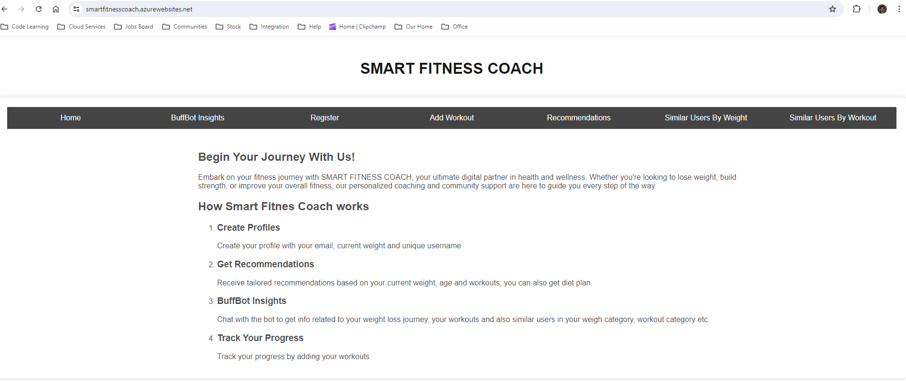
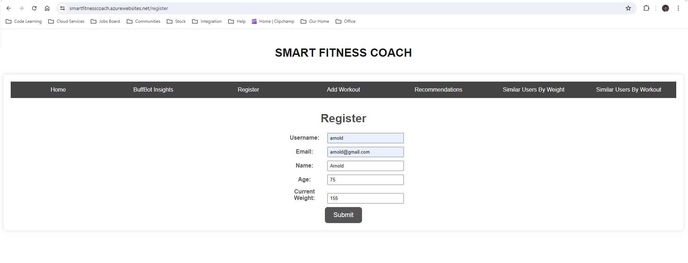
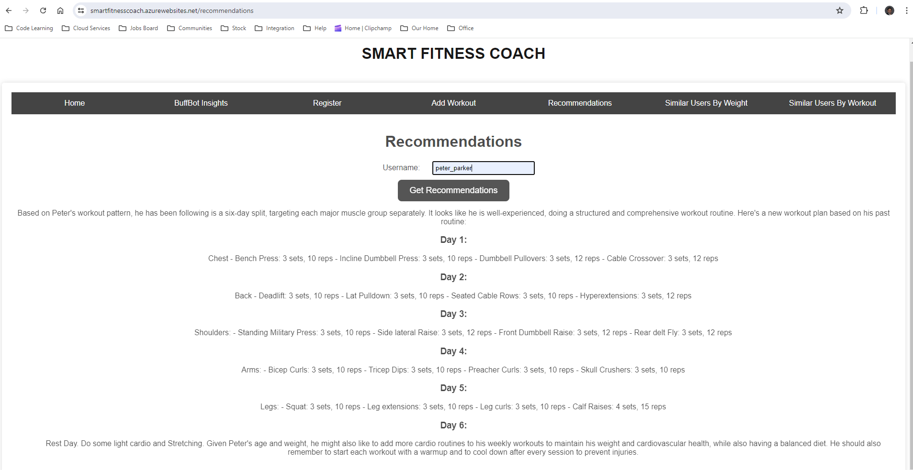
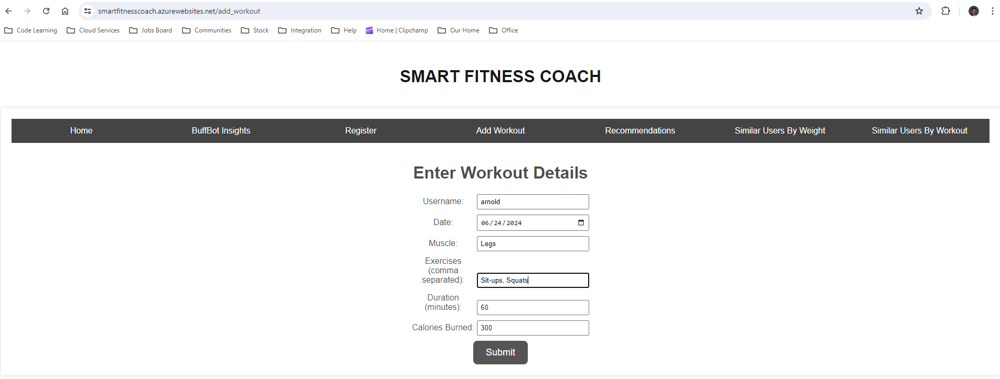
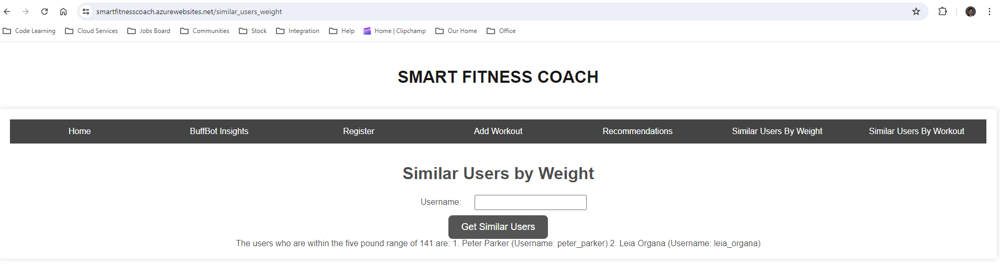
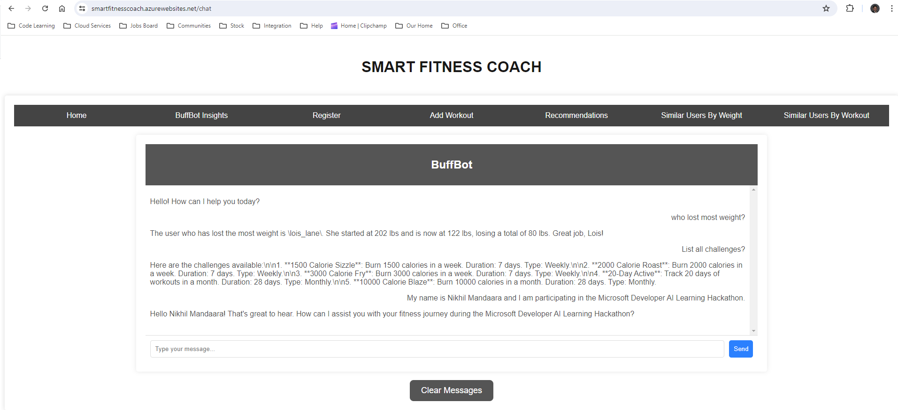

## Inspiration
I'm not a fan of going to the gym, and I know there are others like me who prefer a personalized fitness plan that fits our lifestyles. When I skip the gym, I miss out on the camaraderie and competition with others on their weight loss or muscle-building journeys.

## What it does
This app brings it all together—allowing you to stay home while receiving tailored workout and diet plans based on your weight, age, and previous workouts. Plus, you can track other participants' progress and engage in friendly competition by participating in various challenges. It's like having your gym and fitness community right in the palm of your hand.

## How we built it
The backend of this app is crafted using Python with the FastAPI library, and it utilizes MongoDB in CosmosDB for data storage. Additionally, we've integrated Langchain and Azure OpenAI to power an insights chatbot that delivers personalized recommendations. On the frontend, the application is built using Python and Flask.

## Challenges we ran into
I initially began using React.js but soon found it too complex for my needs. Consequently, I switched to Flask and simple HTML in the final week of the project.

## Accomplishments that we're proud of
I'm proud that this can assist someone like me in returning to fitness. BuffBot Insights is a fantastic chatbot that offers valuable insights based on the data stored in the database.

## What we learned
During Phases 1 and 2, I gained significant knowledge about building a copilot for the app. I was introduced to Langchain and various other modules, as well as the use of MongoDB in CosmosDB. I made sure to enhance security by storing secrets in Azure Key Vault.

## What's next for Smart Fitness Coach
The app connects with fitness trackers such as Fitbit, Apple Watch, and Google Health, automatically importing data instead of requiring manual entry. It also links with meal trackers to analyze macronutrients and dynamically adjusts users' goals to ensure they stay on the right track.

## Website Screenshots

